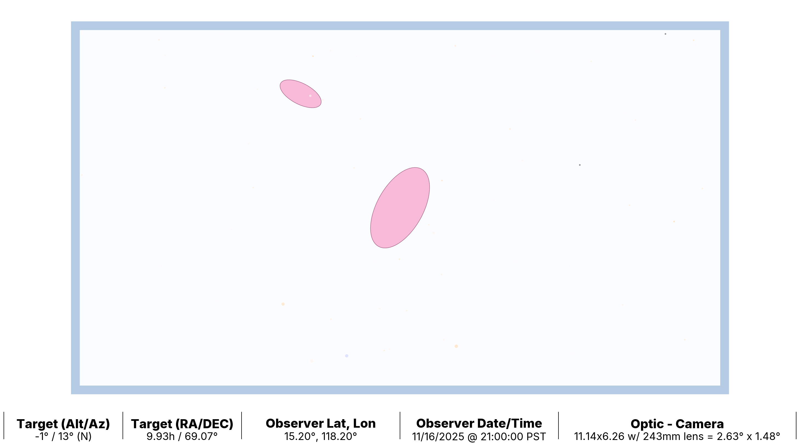
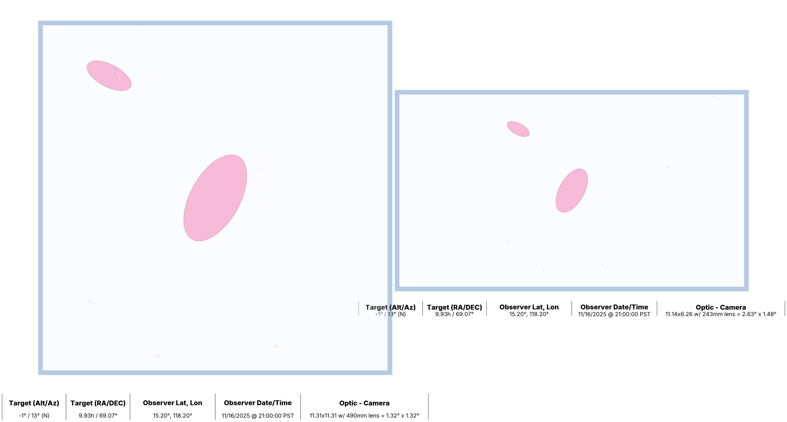

# Astro CCD Scope comparison 

This code tries to show you what a specific Sensor (CCD) and Lense combination will produce. 


This is M81, when using an SV555 and an IMX585 based CCD Camera. 


You can generate other combinations of Sensors/Lense so you may compare expected results.


This shows ASKAR71 with a IMX533 on the left, compared to an SV555 and a IMX585 on the right. 

## Reason for this code 

I am in the market for a new CCD camera - sadly my Nikon decided it had enough and locked up the shutter for good. Faced with a large capital expense I wondered if the time had finally come for a dedicated Astro CCD Camera, with a telescope. 

Prior to this - I have either used prime projection, or camer/lense on a star tracker/EQ mount. 

There are many many choices and options (which is a good thing), but it can also be quite confusingl If you are trying to work out what would suit your budget/interestes etc.

## Alternatives instead of this code 

You can simply create a Telescope, and a Sensor in **Stellarium** or **KStars** (and I am sure many others) and compare as you click around the sky. I wanted something a little more focused, and when I forgot the results of M31 say were, I did not have to repeat the simulation. 

## The code 

There are essentially 3 sections 

  - The Camera (Sensor)
  - The Scope 
  - The Targets 

### Camera/Sensor 

As many manufacturers use a same underlying CCD chip, I think it makes more sense to create a sensor which is *chip named*.

These are the two sensors I initially put into the code - the IMX585 being an APS-C layout i.e. wider than taller. The IMX533 being a *square* format. Dimensions are in mm.

```python

imx585 = Camera(
    sensor_height=6.26, sensor_width=11.14, lens_focal_length=OPTIC_LENSE, rotation=0
)

# Used in ASI 533 Pro. Square Sensor
imx533 = Camera(
    sensor_height=11.31, sensor_width=11.31, lens_focal_length=OPTIC_LENSE, rotation=0
)
```

You will note these both refer to something called **OPTIC_LENSE** ... which is the next item we will explain.

### Scope

The OPTIC_LENSE is simply a way of informting the sensor as to the focal length of the imaging system.

So this is the simple (I hope) way I have defined these items.

```python
SV555 = 243
REDCAT51 = 250
ASKAR71 = 490
```

Yes - that is it... those are the named focal length's of some popular wide field type scopes... if you want to add another, just create a variable and set its focal length (in mm).

You then need to set a Variable to use this value( it means less messing around in the code lower down).

```
#
# Set the Lense (See Above) to the OPTIC_LENSE
#
OPTIC_LENSE = SV555
OPTIC_LENSE_STR = "SV555"
```

### Target List 

The list provided in the code - are the "top 20" DSO's objects according to Google !!, I am sure you will have your own. You are free to add them - just be careful of the format in the list. 

If the object can not be matched, you will be informed on screen. 

```python
    "NGC 0869 - Double Cluster",
    "M104 - Sombrero Galaxy",
```

NGC Objects must have 4 digit codes, and a space in between the NGC and Code.
Messier objects have no spaces.
Please add a description, it will be used in the output file name. 

## Adding the libraries

It should be all over with a 

    pip install -r requirements.txt 

However... you may need to provide the GDAL objects (used by starplot).

## Running 

Simple execute this command where the source file is located 

    python Astro_CCD_Scope.py 

It takes under 30s to process 20 objects on my Mac. After this you can look at the png files.

### How to Compare ??

Change the definitions in the code - Say to the *Askat71* and switch sensors... i.e.

    OPTIC_LENSE =ASKAR71 
    OPTIC_LENSE_STR = "ASKAR71"

    OPTIC_CAMERA = imx533
    OPTIC_CAMERA_STR = "imx533" 

And run the code again.
    
    python Astro_CCD_Scope.py 

When the code has finished you will see new PNG files (using M31 as an example named)

    SV555_imx585_M31_ Andromeda Galaxy.png
    ASKAR71_imx533_M31_ Andromeda Galaxy.png


Using any image viewing software - you now can compare that the scope/ccd combinations are expected to produce. 


## But it does not take into consideration....

  - The sensor is Cooled, if it has a dew heater.
  - I am using mono image capture 
  - My lense is 4F not F8 at this focal length
  - I use a guide scope 
  - I have a super mount - much better than .... 
  - My scope has super optics.
  - The CCD camera has small/large pixels - and a built in guide camera 

None of these things effect the **expected** image size when using a focal length of X, with a Sensor size of Y. 

I do not disagree the items listed previously will generally improve the image quality - but they will not effect the size of the expected data capture area. 

# Thanks 

**StarPlot** is a great framework; many thanks to the authors for publish and creating it. 


