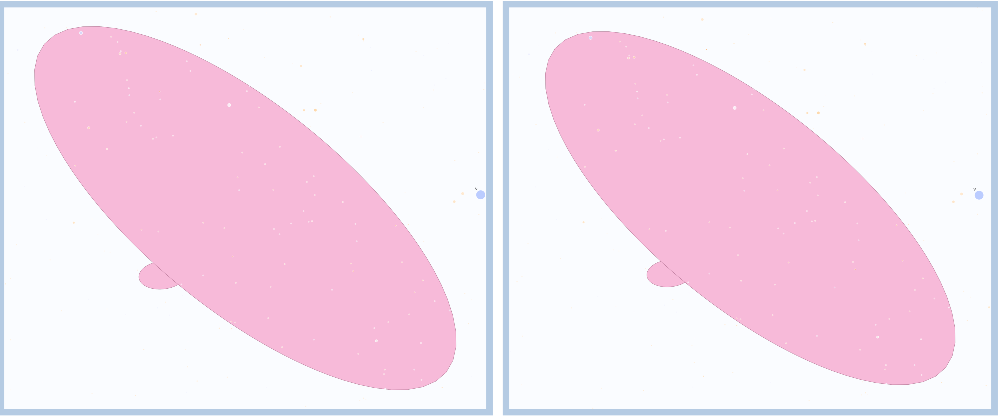

# Astro CCD Scope comparison 

This code tries to show you what a specific Sensor (CCD) and Lense combination will produce. 

This is M81, when using an SV555 and an IMX585 based CCD Camera. 

You can generate other combinations of Sensors/Lense so you may compare expected results.

This shows ASKAR71 with a IMX533 on the left, compared to an SV555 and a IMX585 on the right.  Here you can clearly see the differing sensor formats on the M81.

But this is the same sensor - with very similar lenses.

Redcat51 and SV555 - on M31.

## Reason for this code 

I am in the market for a new CCD camera - sadly my Nikon decided it had enough and locked up the shutter for good. Faced with a large capital expense I wondered if the time had finally come for a dedicated Astro CCD Camera, with a telescope. 

Prior to this - I have either used prime projection, or camer/lense on a star tracker/EQ mount. 

There are many many choices and options (which is a good thing), but it can also be quite confusingl If you are trying to work out what would suit your budget/interestes etc.

## Alternatives instead of this code 

You can simply create a Telescope, and a Sensor in **Stellarium** or **KStars** (and I am sure many others) and compare as you click around the sky. I wanted something a little more focused, and when I forgot the results of M31 say were, I did not have to repeat the simulation. 

## The code 

There are essentially 3 sections 

  - The Camera (Sensor)
  - The Scope 
  - The Targets 

  
I now have split these into seperate files. 

  - Ccd.py 
  - Scope.py 
  - Target.py
  
These files are **VERY SIMPLE** data class collections. 

## Adding the libraries

It should be all over with a 

    pip install -r requirements.txt 

However... you may need to provide the GDAL objects (used by starplot).

## Running 

Simple execute this command where the source file is located 

    python Astro_CCD_Scope.py -c <CAMERA> -s <SCOPE> -t <Target> 
    
Examples:
	python Astro_CCD_Scope.py -c imx585 -s <SCOPE> -t 

It takes under 30s to process 20 objects on my Mac. After this you can look at the png files.

### How to Compare ??

Change the command line options

### Try a different scope

use 

    -s or --scope <scope name> 
  
 You can find the list of scope names using 
 
     python Astro_CCD_Scope.py --list-scopes 

### Try a different camera/sensor 

use 

    -c or --camera <camera name> 
    
 You can find the list of scope names using 
 
     python Astro_CCD_Scope.py --list-cameras 

### Try a different target set 

yes you guessed it 

	-t or --target <target Name> 

 You can find the list of scope names using 
 
     python Astro_CCD_Scope.py --list-targets 

Using any image viewing software - you now can compare that the scope/ccd combinations are expected to produce. 

## But it does not take into consideration....

  - The sensor is Cooled, if it has a dew heater.
  - I am using mono image capture 
  - My lense is 4F not F8 at this focal length
  - I use a guide scope 
  - I have a super mount - much better than .... 
  - My scope has super optics.
  - The CCD camera has small/large pixels - and a built in guide camera 

None of these things effect the **expected** image size when using a focal length of X, with a Sensor size of Y. 

I do not disagree the items listed previously will generally improve the image quality - but they will not effect the size of the expected data capture area. 

# What does not work?

Very wide (<300mm) and very large width Cameras cause an internal error if the amount of sky > 9.6 degrees.

You will get an error message of **✖ Sorry. Field of View too large to compute**

The Sony IMX455 chip is (currently) the only sensor that causes this issue, if used on something like an SV555.

So this would fail 

    python Astro_CCD_Scope.py -c imx455 -s SV555 -t Quick 

But this will work 

    python Astro_CCD_Scope.py -c imx455 -s ASKAR71F -t Quick
    
Becuase the scope has a longer focal length, which despite a massive sensor, makes the FOV (field of view) within bounds (phew!).

# Thanks 

**StarPlot** is a great framework; many thanks to the authors for publish and creating it. 

